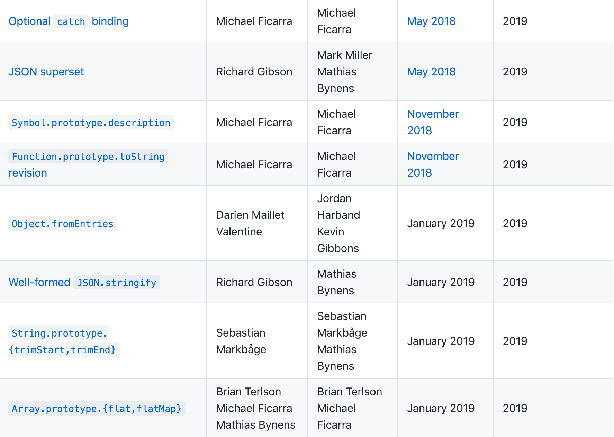

## ES2019

[tc39 Finished Proposals](https://github.com/tc39/proposals/blob/master/finished-proposals.md)



从表中可以看到已经有多个特性加到了 ES2019 中。

## 新特性

### Optional catch binding

[https://github.com/tc39/proposal-optional-catch-binding](https://github.com/tc39/proposal-optional-catch-binding)

将 `err` 变成 `optional` 的，可以省略 `catch` 后的 括号和错误对象：

```javascript
try {
  // tryCode
} catch {
  // catchCode
}
```

#### Previous

之前 `try...catch` 是这样的：

```javascript
try {
  // tryCode
} catch(err) {
  // catchCode
}
```

- tryCode：（必须）尝试执行的代码
- err：（必须）指定局部变量应用的错误
- catchCode：（可选）捕获错误的代码

比如：

```javascript
try {
  throw new Error('报错啦报错啦');
} catch(e) {
  console.log(e); // Error: 报错啦报错啦
}
```

有的时候我们只需要捕获错误但是无需知道错误信息，`err` 就显得没必要的。

### JSON superset

[https://github.com/tc39/proposal-json-superset](https://github.com/tc39/proposal-json-superset)


允许 未转义的 `U + 2028` 行分隔符和 `U + 2029` 段分割符直接出现在字符串中，不会出现异常。

#### Previous

之前，JSON的某些字符 `\u2028` `\u2029` 会导致 Javascript 语法错误。

```javascript
eval('"\u2028"'); // SyntaxError: Unexpected
```

我们的解决方法是对 `\u2028` `\u2029` 进行转义，比如：

```javascript
str.Replace('\u2028', '\\u2028')
```

### Symbol.prototype.description

[https://github.com/tc39/proposal-Symbol-description](https://github.com/tc39/proposal-Symbol-description)

[Symbol.prototype.description | MDN](https://developer.mozilla.org/en-US/docs/Web/JavaScript/Reference/Global_Objects/Symbol/description)

可以通过 `description` 方法获取 `Symbol` 的描述:

```javascript
const name = Symbol('My name is axuebin');
console.log(name.description); // My name is axuebin
console.log(name.description === 'My name is axuebin'); // My name is axuebin
```

#### Previous

我们知道，`Symbol` 的描述只被存储在内部的 `[[Description]]`，没有直接对外暴露，我们只有调用 `Symbol` 的 `toString()` 时才可以读取这个属性：

```javascript
const name = Symbol('My name is axuebin');
console.log(name.toString()); // Symbol(My name is axuebin)
console.log(name); // Symbol(My name is axuebin)
console.log(name === 'Symbol(My name is axuebin)'); // false
console.log(name.toString()) === 'Symbol(My name is axuebin)'); // true

```

在执行 `console.log(name)` 的时候也打印了描述信息，是因为这里隐式地执行了 `toString()`，在代码里这样是不行的。

### Function.prototype.toString revision

[https://github.com/tc39/Function-prototype-toString-revision](https://github.com/tc39/Function-prototype-toString-revision)

现在 `foo.toString()` 可以返回精确字符串，包括空格和注释等。

### Object.fromEntries

[https://github.com/tc39/proposal-object-from-entries](https://github.com/tc39/proposal-object-from-entries)

[Object.fromEntries() | MDN](https://developer.mozilla.org/en-US/docs/Web/JavaScript/Reference/Global_Objects/Object/fromEntries)

该方法把键值对列表转换为一个对象，可以看作是 `Object.entries()` 的反向方法。

- Arguments：(Array): 键值对。
- Returns：(Object): 对象。


```javascript
const arr = Object.entries({ name: 'axuebin', age: 27 });
console.log(arr); // ["name", "axuebin"], ["age', 27]]

const obj = Object.fromEntries(arr);
console.log(obj); // { name: 'axuebin', age: 27 }
```

和 `lodash` 的 `_.fromPairs` 具有一样的功能。

```javascript
const obj = _.fromPairs(['name', 'axuebin'], ['age', 27]);
console.log(obj); // { name: 'axuebin', age: 27 }
```

### Well-formed JSON.stringify

[https://github.com/tc39/proposal-well-formed-stringify](https://github.com/tc39/proposal-well-formed-stringify)

更友好的 `JSON.stringify`，对于一些超出范围的 `Unicode`，为其输出转义序列，使其成为有效 `Unicode`，

```javascript
JSON.stringify('\uDF06\uD834'); // '"\\udf06\\ud834"'
JSON.stringify('\uDEAD'); // '"\\udead"'
```

#### Previous

```javascript
JSON.stringify('\uDF06\uD834'); // '"��"'
JSON.stringify('\uDEAD'); // '"�"'
```

### String.prototype.{trimStart,trimEnd}

[https://github.com/tc39/proposal-string-left-right-trim](https://github.com/tc39/proposal-string-left-right-trim)

[String.prototype.trimStart() | MDN](https://developer.mozilla.org/en-US/docs/Web/JavaScript/Reference/Global_Objects/String/trimStart)

[String.prototype.trimEnd() | MDN](https://developer.mozilla.org/en-US/docs/Web/JavaScript/Reference/Global_Objects/String/trimEnd)

分别去除字符串前后的空格，生成新的字符串。

```javascript
const str = '    axuebin    ';
console.log(str.trimStart()); // 'axuebin    '
console.log(str.trimEnd()); // '    axuebin'
console.log(str); // '    axuebin    '
```

### Array.prototype.{flat,flatMap}

[https://github.com/tc39/proposal-flatMap](https://github.com/tc39/proposal-flatMap)

[Array.prototype.flat() | MDN](https://developer.mozilla.org/en-US/docs/Web/JavaScript/Reference/Global_Objects/Array/flat)

[Array.prototype.flatMap() | MDN](https://developer.mozilla.org/en-US/docs/Web/JavaScript/Reference/Global_Objects/Array/flatMap)

还记得这样一道笔试题么，给你一个多维数组，把它拍平！

```javascript
const arr = [1, [2, [3, [4, [5, 6]]]]];
arr.flat(); // [1, 2, [3, [4, [5, 6]]]]
arr.flat(1); // [1, 2, [3, [4, [5, 6]]]]
arr.flat(2); // [1, 2, 3, [4, [5, 6]]]
arr.flat(3); // [1, 2, 3, 4, [5, 6]]
arr.flat(4); // [1, 2, 3, 4, 5, 6]
```

```javascript
const arr = [[1, 2, 3], [4, 5]];
arr.flatMap(item => item); [1, 2, 3, 4, 5];
```

是不是很方便...

## 暂时就这些啦